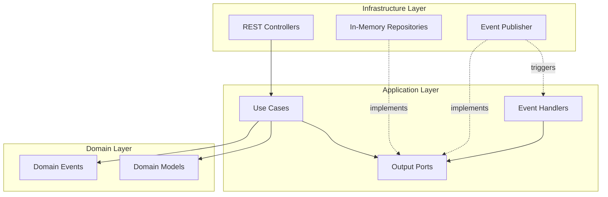
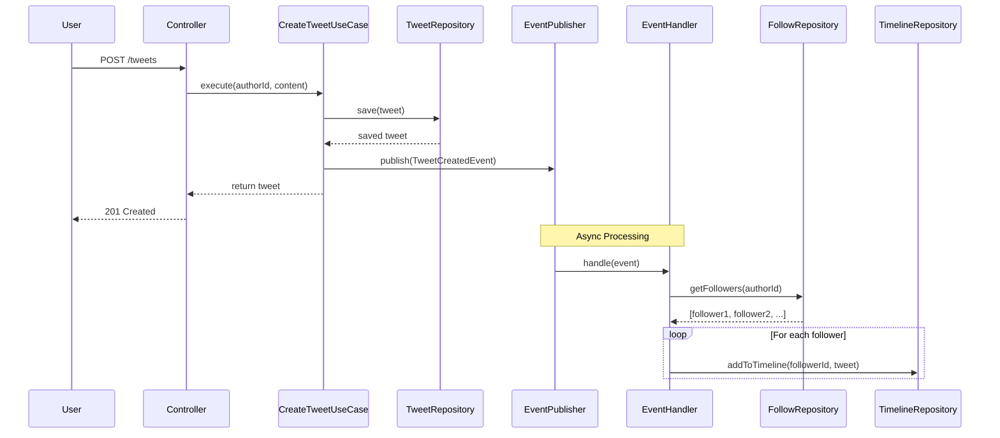

# Mini-X - Twitter-like Microblogging Platform

A backend implementation of a Twitter-like microblogging platform built with **Java 17** and **Spring Boot 3.x**.

## Technology Stack

- **Language**: Java 17 (LTS)
- **Framework**: Spring Boot 3.2.1
- **Build Tool**: Maven
- **Testing**: JUnit 5 + Mockito

## Quick Start

### Prerequisites
- Java 17 (LTS)
- Maven 3.8+

### Option 1: Build and Run Locally

```bash
# Build the project
mvn clean package

# Run tests
mvn test

# Start the application
mvn spring-boot:run
```

### Option 2: Run with Docker

```bash
# Build and run with Docker
docker build -t minix-app .
docker run -p 8080:8080 minix-app

# Or use Docker Compose (recommended)
docker-compose up --build
```

The application will start on **http://localhost:8080**

## API Documentation (Swagger UI)

Once the application is running, you can access swagger documentation at **http://localhost:8080/swagger-ui.html**

## Architecture

### Architecture

The system follows **Hexagonal Architecture** principles with clear separation of concerns:



## Timeline Strategy: Fan-Out on Write

### Sequence Diagram



## Testing

```bash
# Run all tests
mvn test

# Run specific test
mvn test -Dtest=TweetTest
```

## Example Workflow

```bash
# 1. Alice creates a tweet
curl -X POST http://localhost:8080/tweets \
  -H "X-User-Id: alice" \
  -H "Content-Type: application/json" \
  -d '{"content": "Hello from Alice!"}'

# 2. Bob creates a tweet
curl -X POST http://localhost:8080/tweets \
  -H "X-User-Id: bob" \
  -H "Content-Type: application/json" \
  -d '{"content": "Hello from Bob!"}'

# 3. Charlie follows Alice
curl -X POST http://localhost:8080/follow \
  -H "X-User-Id: charlie" \
  -H "Content-Type: application/json" \
  -d '{"followedId": "alice"}'

# 4. Charlie follows Bob
curl -X POST http://localhost:8080/follow \
  -H "X-User-Id: charlie" \
  -H "Content-Type: application/json" \
  -d '{"followedId": "bob"}'

# 5. Charlie retrieves timeline (sees tweets from Alice and Bob)
curl -X GET http://localhost:8080/timeline \
  -H "X-User-Id: charlie"
```


## Business Rules & Constraints

# Business Assumptions & Constraints

## Tweet Rules
- Maximum length: **280 characters**
- Content cannot be empty
- Each tweet has a unique UUID
- Timestamped with creation time

## Follow Rules
- Users can follow other users (one-way relationship)
- No self-following validation (allowed for simplicity)
- Follow relationships are **strongly consistent** (immediate)
- Duplicate follows are idempotent

## Timeline Rules
- Shows tweets from followed users only
- Ordered by creation time (newest first)
- Returns top **50 items** maximum
- Updates are **eventually consistent** (async fan-out)
- Empty timeline is valid

## Key Design Decisions

| Decision | Rationale |
|----------|-----------|
| **Hexagonal Architecture** | Enables testability and framework independence |
| **Fan-out on write** | Optimizes for read-heavy workload (Twitter-like) |
| **Eventual consistency** | Acceptable for social media timeline |
| **In-memory storage** | Simplifies MVP, easy to replace later |
| **Async event handling** | Decouples write path from fan-out |
| **No authentication** | Focuses on core architecture |

## Out of Scope

This MVP intentionally excludes:
- Authentication/Authorization
- Database persistence
- Likes, retweets, replies
- Tweet editing/deletion
- Frontend UI
- Pagination
- Search functionality

## Pending Improvements

1. Layer-to-Layer Mappers: Mappers between domain models, DTOs, and persistence entities.
2. Caching Layer: Cache implementation over persistence layer.
3. Persistent Storage: replace In-memory storage with an actual database.
4. Microservice cloud with message Queue for Event Handling: Extract different logic in different microservices and use queue communication.
5. Observability & Monitoring: Comprehensive monitoring, logging and tracing.
6. API Versioning & Backward Compatibility: API versioning strategy.
7. CI/CD Pipeline: Automated deployment pipeline.
8. Documentation & API Contracts: Comprehensive API documentation and contracts.
9. Timeline could be limited to X number of tweets, preventing it to grow without limits. Also, follower backfill should consider this using the last tweet date to get tweets from the new followed ony from that date.
